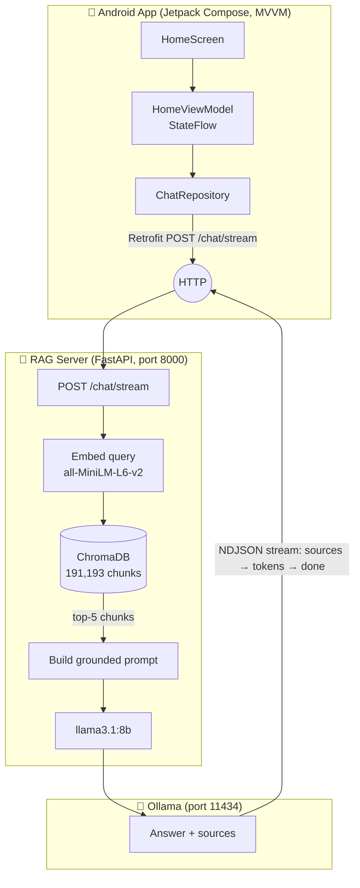
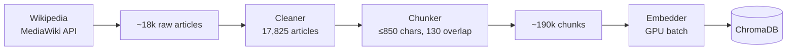

# 🎮 Video Game Wizard

> A full-stack, **fully-local** AI assistant for video games — an Android (Jetpack Compose)
> chat app backed by a self-hosted Retrieval-Augmented Generation (RAG) pipeline over
> ~190k Wikipedia chunks and a locally-served **Llama 3.1 8B**. No cloud APIs, no API keys —
> everything runs on consumer hardware.

<!-- Badges -->
[](https://github.com/PopToTheRock/VideoGameWizard/actions/workflows/android-ci.yml)


---

## ✨ Why this project

Most "AI app" portfolios are a thin wrapper around a hosted LLM API. This one is the opposite:
it implements the **entire stack** that a hosted API hides from you.

- 🔒 **Private & offline-capable** — the model, the vector database, and the API all run on
  your own machine. No data leaves the device.
- 🧱 **Three disciplines in one repo** — a production-style **Android** client, a **Python**
  data/ML pipeline, and a **FastAPI** backend service.
- 🧠 **Real RAG, not a toy** — ~18k Wikipedia game articles cleaned, chunked, embedded, and
  served from a 190k-chunk vector index.

## 📸 Demo

> _Demo video and screenshots coming soon (see [Roadmap](ROADMAP.md), Milestone 5)._

<!--


-->

## 🏗️ Architecture

Three processes cooperate to answer a question. The Android app never talks to the model
directly — it goes through a RAG server that grounds every answer in retrieved context.



Answers **stream token-by-token** to the app and arrive with **source citations** rendered
as tappable Wikipedia chips. (A buffered `POST /chat` is kept for scripts and the eval
harness.)

### Data & RAG pipeline (offline, one-time)



## 🧰 Tech stack

| Layer | Technologies |
|------|--------------|
| **Android** | Kotlin, Jetpack Compose, Material 3, Navigation Compose (type-safe routes), MVVM + `StateFlow`, Coroutines, Retrofit + OkHttp, kotlinx.serialization, Room (chat-history persistence), manual DI (`AppContainer`) |
| **Backend** | Python, FastAPI, Uvicorn, Pydantic |
| **ML / RAG** | sentence-transformers (`all-MiniLM-L6-v2`), ChromaDB (cosine, HNSW), Ollama, Llama 3.1 8B |
| **Data** | MediaWiki Action API, JSONL, regex-based cleaning |
| **Tooling** | Gradle (Kotlin DSL), Android Studio, WSL2 (for fine-tuning) |

## 📁 Repository structure

```
VideoGameWizard/
├── app/                      # Android application (Jetpack Compose, MVVM)
│   └── src/main/java/dev/alexn/videogamewizard/
│       ├── navigation/       # Type-safe Navigation Compose routes
│       ├── data/             # model / network (Retrofit) / repository
│       └── ui/               # screens, components, theme
├── scraping/                 # Python data + RAG pipeline
│   ├── wikipedia/            # MediaWiki fetcher + cleaner
│   ├── rag/                  # chunker, embedder, FastAPI server
│   │   └── eval/             # retrieval-quality eval harness (hit@k / MRR / nDCG + reranking)
│   └── finetune/             # QLoRA fine-tuning pipeline + model card (vgw-rag:8b)
├── docs/                     # AUDIT.md — full professional audit report
├── ATTRIBUTION.md            # Data/model licenses (Wikipedia CC BY-SA, Llama, MiniLM)
├── CLAUDE.md                 # Internal architecture & dev notes
└── ROADMAP.md                # Portfolio roadmap (this project's plan)
```

## 🚀 Getting started

### Prerequisites
- **Android Studio** (latest) with an emulator or a physical device
- **[Ollama](https://ollama.com)** with the model pulled: `ollama pull llama3.1:8b`
- **Python 3.11+** for the RAG server
- A CUDA GPU is recommended for (re)building embeddings, but not required to run the server

> **Fastest path — Docker Compose.** From `scraping/`, `docker compose up --build` brings up
> both the RAG server and Ollama (the image installs only `requirements-server.txt`, so it
> stays slim). On first run, pull the model into the Ollama service:
> `docker compose exec ollama ollama pull llama3.1:8b`. A prebuilt ChromaDB index is expected
> at `scraping/data/chromadb` — build it once with **step 0** below.
>
> The manual steps below are the alternative if you'd rather run the pieces directly.

### 0. Build the knowledge base (one-time, ~3 h)

The Wikipedia corpus and the vector index are **not** in the repo (they're CC BY-SA-licensed
data, kept out of the MIT-licensed tree — see [ATTRIBUTION.md](ATTRIBUTION.md)). The server
won't start without the index, so build it once:

```bash
cd scraping
pip install -r requirements.txt      # full pipeline deps (torch, sentence-transformers, chromadb, …)

cd wikipedia
python wikipedia_fetcher.py          # ~2.5 h — crawls ~18k game articles via the MediaWiki API
python wikipedia_cleaner.py          # strips boilerplate → wikipedia_clean.jsonl

cd ../rag
python chunker.py                    # paragraph-aligned chunks, ≤850 chars → chunks.jsonl
python embed.py                      # embeds ~190k chunks into ChromaDB (GPU: minutes · CPU: hours)
```

A CUDA GPU makes `embed.py` take minutes instead of hours; everything else is CPU-bound.

### 1. Start the model
```bash
ollama serve
```

### 2. Start the RAG server
```bash
cd scraping
pip install -r requirements.txt      # server only: requirements-server.txt · CI/test: requirements-test.txt
cd rag
uvicorn server:app --host 127.0.0.1 --port 8000   # loopback — safe default for the emulator
```
Endpoints: `/health` · `/stats` · interactive API docs at <http://localhost:8000/docs>.
Configuration is environment-driven — override any default with a `VGW_` variable,
e.g. `VGW_OLLAMA_MODEL=llama3.1:70b`.

> **Exposing to a physical device.** Binding `--host 0.0.0.0` reaches the server from a
> phone on your LAN, but also from anything else on the subnet. The `/chat`, `/chat/stream`,
> `/feedback` and `/stats` routes can be gated behind a shared secret — set `VGW_API_KEY`,
> which clients must send as an `X-API-Key` header. **Note:** the Android app does not yet
> send this header (planned — see ROADMAP), so with a key set, only scripts/`curl` can talk
> to the server. For the app on a physical device today, prefer a trusted LAN and keep the
> server firewalled.

### 3. Run the Android app
Open the project in Android Studio and run on an emulator.

- **Emulator**: works out of the box — `10.0.2.2` maps to your PC's `localhost`.
- **Physical device**: override `BASE_URL` (exposed via `BuildConfig`) with your PC's LAN IP.

## 🗺️ Roadmap

This is an actively-evolving portfolio project. See **[ROADMAP.md](ROADMAP.md)** for the full
plan. Highlights shipped: testing & CI, backend hardening, a
**[RAG evaluation harness](scraping/rag/eval/README.md)** (cross-encoder reranking lifts
article-level hit@1 0.53→0.68, chunk-level 0.29→0.47 — measured offline; the server currently
serves baseline top-k retrieval), and **[QLoRA fine-tuning](scraping/finetune/README.md)** of
Llama 3.1 8B into a grounded RAG reader (`vgw-rag:8b`) — the headline milestone.

## 📄 License & attribution

The original **source code** in this repository is licensed [MIT](LICENSE) © Alex N.

The project also incorporates third-party data and models under their own licenses, which
the MIT license does **not** cover:

- **Knowledge corpus & data derived from it** (the committed `train`/`val`/`eval` sets and
  the vector index) come from **English Wikipedia** and are licensed
  **[CC BY-SA 4.0](https://creativecommons.org/licenses/by-sa/4.0/)** (attribution +
  share-alike).
- **Models** (Llama 3.1, the MiniLM embedder/reranker) are used under their respective
  licenses.

See **[ATTRIBUTION.md](ATTRIBUTION.md)** for the full breakdown and your obligations when
redistributing.
