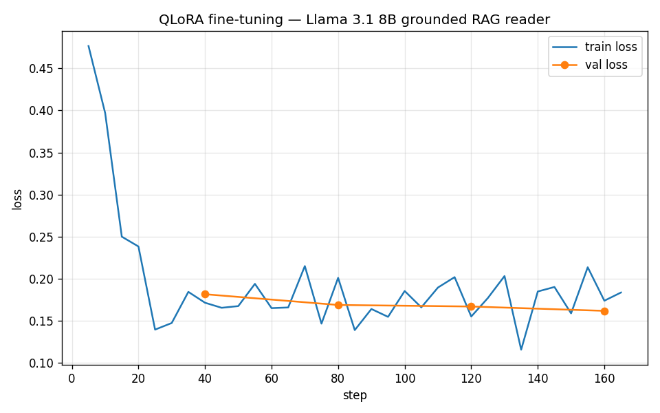

# Model Card — VideoGameWizard Grounded RAG Reader (QLoRA)

A QLoRA fine-tune of **Llama 3.1 8B Instruct** that adapts the model into a
better *grounded RAG reader*: fluent at answering a question **from retrieved
context**, concisely, in the VideoGameWizard voice.

> **Fine-tuning teaches skill, not facts.** The RAG pipeline already supplies the
> facts (190k Wikipedia chunks in ChromaDB). This fine-tune does the
> complementary job — teaching the model to *use* that context the way we want:
> answer directly, stay grounded, don't pad. We deliberately did **not** try to
> inject knowledge via fine-tuning (QLoRA does that poorly, and it's redundant
> with retrieval).

## Data

| | |
|--|--|
| Source | 1,500 chunks sampled (seed 42) from the same `chunks.jsonl` corpus the server retrieves over |
| Labels | `llama3.1:8b` writes one (question, grounded answer) per chunk — self-distillation of the target behavior |
| Split | **1,350 train / 150 val** |
| Leakage control | every chunk in the retrieval eval set was **excluded** from training — 0 overlap, verified *at prep time*. The eval set was later regenerated after a re-chunking fix, so the guarantee is point-in-time: 1 of the 150 *current* gold chunks also appears as a training context |
| Format | `messages` (system+user+assistant); the **system message carries the chunk**, using the same system-prompt text as the server. (Known small train/serve delta: the HF training template prepends Llama's date-header lines, which Ollama's serving template omits.) |
| Loss | **assistant-only** (the prompt, including the context, is masked) — the model is graded only on the answer it produces |

Built by `prepare_data.py`; the dataset (`data/train.jsonl`, `data/val.jsonl`) is
committed as the canonical training set.

## Training

QLoRA (4-bit base + LoRA adapters) via **Unsloth + TRL `SFTTrainer`**, on an
RTX 5070 Ti (Blackwell, sm_120) in WSL2. Config (`training_summary.json`):

| hyperparameter | value |
|----------------|-------|
| base model | `unsloth/Meta-Llama-3.1-8B-Instruct-bnb-4bit` |
| LoRA rank / alpha | 16 / 16 |
| target modules | q,k,v,o,gate,up,down |
| epochs | 1 (169 steps) |
| effective batch size | 8 (2 × grad-accum 4) |
| learning rate | 2e-4, linear, 3% warmup |
| precision | bf16, `adamw_8bit` |
| max seq length | 2048 |
| train runtime | **~8.6 min** |

### Loss curve



| | train loss | val loss |
|--|-----------:|---------:|
| final | 0.192 | **0.161** |

Train loss drops from **0.48 → ~0.14** within ~25 steps, then plateaus. Crucially,
**val loss decreases monotonically** (0.181 → 0.169 → 0.167 → 0.161) — the model
is generalizing, not memorizing.

> Note: the `final` row's train loss (0.192) is the **epoch mean** (it includes the
> high early steps), while val loss (0.161) is measured at convergence — so the two
> aren't directly comparable. The converged per-step train loss (~0.14) is slightly
> *below* val, the normal ordering; don't read the 0.192 vs 0.161 gap as a signal.

## Results — base vs. fine-tuned

**Downstream win-rate (the metric that matters).** Val loss only shows the adapter
learned the target *distribution*; it doesn't show the fine-tune is *better* at the
deployed RAG-reader task (and since the teacher authored the labels, low val loss
partly reflects self-distillation). `judge_models.py` measures the real thing: it
sends the identical grounded prompt from each held-out val question to both models
and has a **neutral judge** pick the better answer on **grounding + conciseness**.
Deterministic (temp 0, fixed seed 42), A/B order alternated per item to cancel
position bias, and the judge (`qwen2.5:7b`) is a *different model family* from both
contestants, so neither is grading its own output.

Over the **full 150-question held-out val split**:

| outcome | count |
|---------|------:|
| **Fine-tuned wins** (`vgw-rag:8b`) | **67** |
| Base wins (`llama3.1:8b`) | 49 |
| Tie | 34 |

- **Decided win-rate: 57.8%** (67 of 116 non-tie matchups) — 95% Wilson CI **[48.7%, 66.4%]**
- Overall win-rate: 44.7% (ties counted as non-wins) — 95% Wilson CI [36.9%, 52.7%]
- Tie rate: 22.7%

**Read honestly.** When the judge expressed a preference, the fine-tune won **57.8%** of
head-to-head matchups (+18 net wins over 116 decided games) — a real edge in the intended
direction. But at this sample size it is **not yet statistically significant**: the Wilson
interval just crosses 50% and a two-sided binomial test gives *p* ≈ 0.11. The defensible
claim is therefore *"the fine-tune is at least as good as the 8B base and trends better on
grounding + conciseness,"* **not** *"decisively better."* The 22.7% tie rate is expected —
on easy single-fact questions the two models converge on the same short answer.

The judge's rationales match the qualitative picture below: fine-tuned wins are cited as
*"more concise, directly matches the reference,"* while base wins cluster on **enumeration**
questions (e.g. *"includes all courses mentioned in the context"*) — the exact
over-compression failure mode noted under [Honest limitations](#honest-limitations). All
150 verdicts parsed cleanly (0 malformed judge outputs).

```bash
# reproduce — from scraping/, needs Ollama + all three models pulled
py -m finetune.judge_models --finetuned vgw-rag:8b --judge qwen2.5:7b --n 150
```

Per-question verdicts + reasons: `judge_results.json`; summary table: `judge_results.md`.

**Proxy metric.** Held-out **val loss 0.161** (the fine-tune fits the grounded-answer
target the base model does not produce by default).

Qualitative (`comparison.md`, identical grounded prompt to both): the fine-tune
is consistently **more concise and reference-aligned**, dropping the base model's
verbose scaffolding. Representative held-out cases:

> **Q:** How do human characters gain skills in *Shin Megami Tensei: Devil Survivor*?
> **Base:** *...uses the "Skill Crack" feature. This involves targeting a skill from a specified enemy unit and then defeating that unit... Once a skill is cracked, the player can assign it to any human character.*
> **Fine-tuned:** *Human characters gain new active and passive skills from enemies using Skill Crack, where they target a skill from a specified unit, then must defeat that unit with the assigned squad.* ✅ matches reference

> **Q:** How many lots are in Del Sol Valley in *The Sims 4: Get Famous*?
> **Base:** *There are 11 lots in Del Sol Valley, a new world in The Sims 4 expansion pack Get Famous.*
> **Fine-tuned:** *Del Sol Valley has a total of eleven lots.* ✅ concise, grounded

### Honest limitations

- **Over-compression.** Brevity occasionally costs completeness: on one question
  the fine-tune listed two of three new golf courses where the base listed all
  three. The conciseness objective has a real failure mode on enumeration answers.
- **Teacher ceiling.** Labels come from `llama3.1:8b` itself, so the fine-tune
  inherits the teacher's style and any of its errors — it cannot exceed the
  teacher's factual accuracy, only sharpen the format/grounding behavior. The
  judge's "consistent with the reference" criterion also mildly favors the
  fine-tune, since the references share the teacher's concise style.
- **The eval measures the training-shaped task, not the deployed one.** Training,
  val, and the judge all prompt with a *single gold chunk*; the deployed server
  stuffs the **top-5 retrieved chunks** (including distractors) into the context.
  The win-rate is evidence for the reader skill itself — how the edge holds up
  with distractor chunks is unmeasured.
- **Single epoch, r=16.** A deliberately light, fast configuration; not pushed for
  maximum lift.

## Reproduce

> The committed `data/*.jsonl` are the canonical training set. Step 1 samples from
> the *current* `chunks.jsonl`, which has been re-chunked since the original run —
> so the same seed no longer regenerates the identical dataset. Skip step 1 to
> train on the committed data.

```bash
# 1. Data prep (Windows, needs Ollama serving llama3.1:8b)
cd scraping
py -m finetune.prepare_data --n 1500 --seed 42

# 2. Train (WSL2 venv: torch cu128 + Unsloth)
python -m finetune.train_qlora --epochs 1

# 3. Merge adapter -> 16-bit (WSL2)
python -m finetune.export_merged

# 4. Register + quantize in Ollama (Windows)
ollama create vgw-rag:8b --quantize q4_K_M -f finetune/Modelfile

# 5. Compare base vs fine-tuned on held-out questions
py -m finetune.compare_models --n 6
```

## Serve it

The fine-tuned model is a drop-in for the RAG server — same Llama-3.1 chat
template, same prompt. Point the server at it with one env var:

```bash
VGW_OLLAMA_MODEL=vgw-rag:8b uvicorn server:app --host 0.0.0.0 --port 8000
```

(The server's default stays `llama3.1:8b` so a fresh clone works before anyone
runs the training pipeline.)

## Files

| File | Purpose |
|------|---------|
| `prepare_data.py` | Build the instruction dataset (grounded, eval-disjoint) |
| `train_qlora.py` | QLoRA training (Unsloth + TRL), loss curve + summary |
| `export_merged.py` | Merge adapter → 16-bit HF checkpoint |
| `compare_models.py` | Base vs. fine-tuned on held-out questions (qualitative) |
| `judge_models.py` | Neutral-judge win-rate, base vs. fine-tuned (quantitative) |
| `Modelfile` | Ollama recipe (inherits the base Llama-3.1 template) |
| `data/*.jsonl` | Committed train/val sets |
| `loss_curve.png`, `training_summary.json`, `comparison.md`, `judge_results.{md,json}` | Committed results |
| `outputs/` | Adapter, merged model (gitignored — large) |
